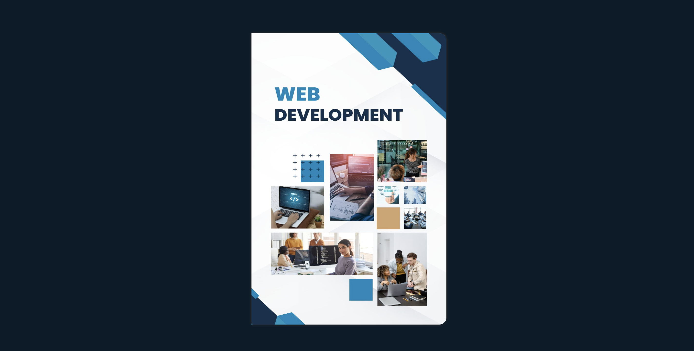

# 📖 Flip Book 

Welcome to the **Flip Book** project — a fun, interactive, and responsive website built with just **HTML** and **CSS**!  
This website simulates the effect of flipping through the pages of a real book.

---

## ✨ Features

- 📚 Realistic Page Flipping Animation
- 🎨 Responsive Design for All Devices
- 🖼️ Beautiful Dashboard with Interactive Icons
- 🔗 Smooth Navigation Across Pages

---

## 🖥️ Screenshot

> Here’s a preview of the dashboard:




---

## 🛠️ Tech Stack

- **HTML5**
- **CSS3**

---

## 📁 Project Structure

```
flip-book/
├── index.html
├── style.css
├── images/
├── README.md
```

🚀 How to Run Locally
Clone the Repository

```
git clone https://github.com/shelavalepallavi/flip-book.git
```

Open index.html in your favorite browser.

Enjoy!

🔥 Interactive Icons

